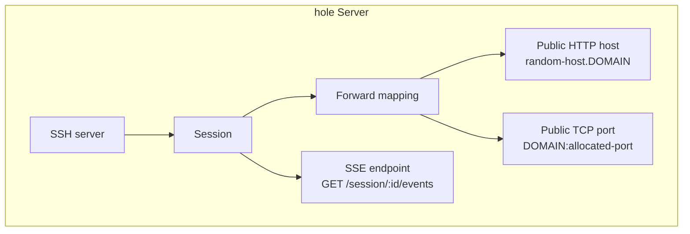
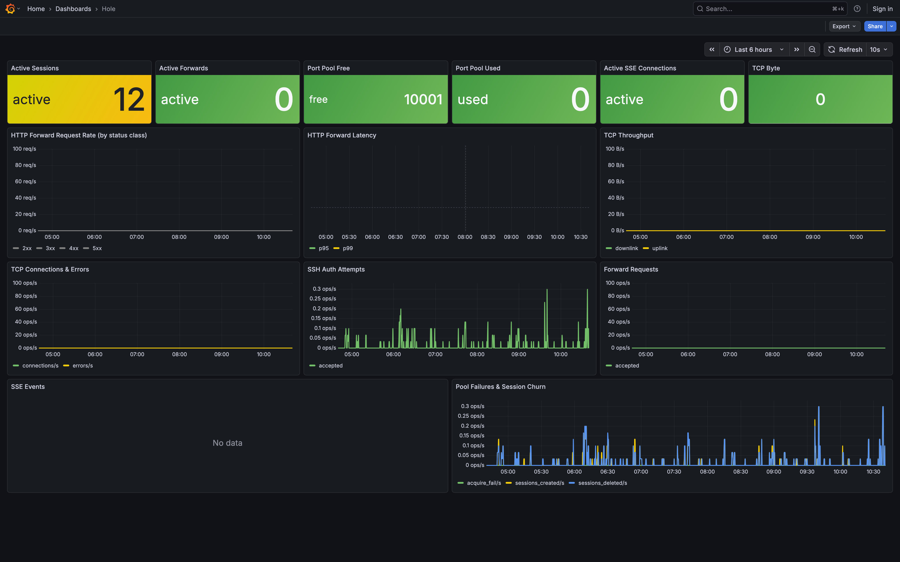

# Hole

English | [한국어](./README.ko.md)

`hole` is an SSH-based tunneling server for exposing local HTTP and TCP services through a single public domain. The repository is organized as a pnpm workspace monorepo with a NestJS API in `apps/api` and a Vite + React + TypeScript frontend in `apps/web`.

## What It Does

- Accepts SSH connections and allocates a dedicated session for each client
- Creates remote port forwards for raw TCP traffic
- Routes HTTP requests from `<random-host>.<DOMAIN>` to the forwarded local service
- Streams session snapshots and request events over SSE
- Exposes Prometheus metrics for sessions, forwards, traffic, authentication, and SSE usage

## How It Works

1. A client connects to the SSH server.
2. The server creates a session and prints session metadata in the shell.
3. The client requests a remote port forward with `tcpip-forward`.
4. `hole` allocates a tunnel port and a random HTTP subdomain for that forward.
5. Incoming traffic is routed to the forwarded service:
   - HTTP: `https://<random-host>.<DOMAIN>`
   - TCP: `<DOMAIN>:<allocated-port>`
6. Session changes are broadcast through `GET /session/:id/events`.

### SSH Tunnel Flow



Read it in three steps:

1. `hole` accepts an SSH connection and creates a session.
2. The session stores forward mapping information.
3. That mapping is exposed as:
   - one HTTP hostname: `https://<random-host>.<DOMAIN>`
   - one TCP port: `<DOMAIN>:<allocated-port>`
   - one SSE stream: `GET /session/:id/events`

`hole` does not expose the local app directly. It first accepts an SSH connection, then creates a server-side forward entry made of:

- one allocated TCP port from `TUNNEL_PORT_RANGE`
- one random HTTP host mapped under `DOMAIN`
- one session record used for shell output, metrics, and SSE events

For HTTP traffic, `ForwardMiddleware` parses the incoming host, finds the matching forward in `SessionService`, and proxies the request to `FORWARD_TARGET_HOST:<allocated-port>`. That allocated port is backed by a temporary TCP server created during `tcpip-forward`, and each incoming socket is bridged through `client.forwardOut(...)` over the existing SSH connection to the client-side local service.

For raw TCP traffic, clients connect straight to `<DOMAIN>:<allocated-port>`. The temporary TCP server accepts the socket and uses the same `forwardOut(...)` bridge, so both HTTP and TCP tunnels ultimately reuse the same SSH session while keeping routing metadata on the server.

## Session Shell Output

When a shell is opened over SSH, the server prints the current session information:

```text
sessionId: <session-id>
sessionEvents: https://<DOMAIN>/session/<session-id>/events (SSE)
connectedAt: 2026-03-16T00:00:00.000Z

forwards:
- http: https://<random-host>.<DOMAIN>, tcp: <DOMAIN>:<allocated-port>
```

The shell output is refreshed automatically when a forward is added or removed.

## Endpoints

- `GET /metrics`
  - Prometheus metrics endpoint
- `GET /session/:id/events`
  - SSE stream with session snapshots, HTTP request events, and session deletion events

## Configuration

The server reads its runtime configuration from environment variables:

```bash
DOMAIN=example.com
FORWARD_TARGET_HOST=127.0.0.1
HTTP_PORT=3000
SSH_HOST=0.0.0.0
SSH_PORT=2222
SSH_HOST_KEY_PATH=./host.key
SSH_AUTH_MODE=noauth
SSH_AUTH_USERNAME=
SSH_AUTH_PASSWORD=
TUNNEL_PORT_RANGE=40000-40100
```

### Environment Variables

- `DOMAIN`: Base domain used for generated HTTP tunnel hosts
- `FORWARD_TARGET_HOST`: Internal target host used when proxying HTTP traffic to the forwarded port
- `HTTP_PORT`: HTTP server port for metrics, HTTP forwarding, and session SSE
- `SSH_HOST`: SSH bind address
- `SSH_PORT`: SSH bind port
- `SSH_HOST_KEY_PATH`: Path to the SSH host key file. If the file does not exist, an ED25519 key pair is generated automatically.
- `SSH_AUTH_MODE`: SSH authentication mode. Supported values are `noauth` and `password`.
- `SSH_AUTH_USERNAME`: Optional username restriction when `SSH_AUTH_MODE=password`
- `SSH_AUTH_PASSWORD`: Required password when `SSH_AUTH_MODE=password`
- `TUNNEL_PORT_RANGE`: Optional port allocation range in `min-max` format

## Getting Started

### Install

```bash
pnpm install
```

### Run

```bash
# install workspace dependencies
pnpm install

# run the Nest API only
pnpm run dev:api

# run the Vite frontend only
pnpm run dev:web

# run both apps together
pnpm run dev

# production builds
pnpm run build
pnpm run start:prod
```

### Test

```bash
pnpm run test
pnpm run test:e2e
pnpm run test:cov
```

## Workspace Layout

- `apps/api`: NestJS tunnel server, SSH handling, metrics, and session SSE
- `apps/web`: Vite React frontend for operational UI work

## Containers

- API image build: `docker build -f Dockerfile -t hole-api .`
- Web image build: `docker build -f Dockerfile.web -t hole-web .`

The web container serves the Vite build through Nginx with SPA fallback. API and web image publishing are split into separate GitHub Actions workflows.

## Observability

`hole` tracks:

- active sessions and total session lifecycle events
- active forwards and failed port allocations
- SSH authentication attempts
- forwarded TCP connections, bytes, and errors
- forwarded HTTP request counts and latency histograms
- active SSE connections and emitted SSE event counts

## Grafana Dashboard

A ready-to-import Grafana dashboard is included at `ops/grafana/dashboards/hole-overview.json`.



## License

MIT
